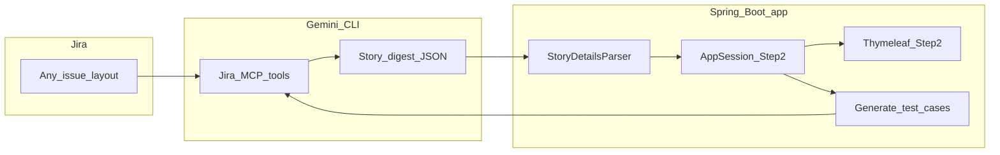

# AI Test Case Generator — Spring Boot + Thymeleaf

Same functionality as the Streamlit app, but runs as a **standard Java web app**. No Streamlit/Python required—ideal for environments where Streamlit is blocked (e.g. corporate laptops).

## Features

- **Jira Integration** — Search, fetch stories, create sub-tasks via Gemini CLI (built-in Jira MCP)
- **3-Step Workflow** — Fetch Story → Review & Generate → Refine & Export
- **AI Test Cases** — Generated from Jira stories with Priority, Severity, Test Type
- **Export** — Excel, JSON, Allure TestOps CSV
- **Create in Jira** — One sub-task per story with all test cases
- **Offline Cache** — Story details cached locally
- **Flexible Jira content** — Story digest (markdown, tables, bullets) via AI; optional attachment **names** listed (no file download in-app)

## How Jira content is handled (flow)

Jira issues can mix **headings, tables, paragraphs, bullets, examples**, technical or non-technical, small or large. The app does **not** rely on one rigid text format. **Gemini** reads the issue through Jira MCP and returns a **structured JSON digest**; the UI shows it on Step 2; **Java** parses JSON first, with markdown/legacy fallbacks if the model returns plain text.



**Illustrative patterns** (tables, big stories, attachments metadata only): see **[docs/jira-content-patterns-demo.txt](docs/jira-content-patterns-demo.txt)**.

**Resilience** (timeouts, retries, safe CLI JSON extraction, clear errors): configure `gemini.cli.*` in `application.properties` (see Configuration below).

## Prerequisites

1. **Java 17+**
2. **Maven 3.6+**
3. **Gemini CLI** — https://github.com/google-gemini/gemini-cli  
   - **Windows (npm):** `npm install -g @google/gemini-cli` (auto-detects `AppData/Roaming/npm/gemini.cmd`)
   - **macOS/Linux:** Install via package manager; ensure `gemini` is in PATH
4. **Jira** — Built-in MCP; complete OAuth in Gemini CLI if your Jira instance requires it

## Build & Run

```bash
cd springboot-testcase-app
mvn spring-boot:run
```

Open http://localhost:8080

## Package as JAR (for deployment)

```bash
mvn clean package
java -jar target/testcase-generator-1.0.0.jar
```

## Configuration

Edit `src/main/resources/application.properties`:

| Property | Default | Description |
|----------|---------|-------------|
| server.port | 8080 | HTTP port |
| gemini.cli.timeout | 300 | Default timeout (seconds) for Gemini subprocess |
| gemini.cli.timeout.search / .fetch / .generate / .subtask | 0 | Per-operation timeout (0 = use `gemini.cli.timeout`) |
| gemini.cli.retry.max-attempts | 2 | Retries for transient CLI failures |
| gemini.cli.retry.delay-ms | 1500 | Delay between retries |
| gemini.cli.log.max-info-chars | 8000 | Truncate long stdout at INFO (full at DEBUG) |
| gemini.env.extra | (empty) | Extra env vars for Gemini subprocess (format: KEY1=value1;KEY2=value2) |
| gemini.jira.prompts.path | classpath:jira-prompts.json | Path to Jira prompt templates JSON (use file:./config/jira-prompts.json for external) |
| story.cache.enabled | false | Offline story cache (set true to enable) |

### External Jira Prompts (JSON)

Jira prompt templates can be loaded from an external JSON file. Copy `src/main/resources/jira-prompts.json` to `config/jira-prompts.json` and set:

```properties
gemini.jira.prompts.path=file:./config/jira-prompts.json
```

**JSON format:** Each key (`search`, `fetchStory`, `generateTestCases`, `createSubtask`) has a `promptTemplate` with placeholders like `{query}`, `{storyKey}`, `{title}`, `{description}`, `{attachmentsNote}`, etc. Fetch expects a **single JSON object** from Gemini (see `jira-prompts.json` for the rich digest shape).

## Project Structure

```
springboot-testcase-app/
├── docs/
│   └── jira-content-patterns-demo.txt   # Example Jira content patterns (illustrative)
├── pom.xml
├── src/main/java/com/example/testcase/
│   ├── config/JiraPromptsConfig.java   # Loads Jira prompts from JSON
│   ├── TestCaseApplication.java
│   ├── controller/TestCaseController.java
│   ├── service/
│   │   ├── GeminiCliService.java       # Gemini CLI subprocess, retries, Jira flows
│   │   ├── StoryDetailsParser.java     # JSON-first + markdown + legacy fallbacks
│   │   ├── MarkdownService.java        # Renders story markdown on Step 2
│   │   ├── StoryCacheService.java
│   │   ├── TableParserService.java
│   │   └── ExportService.java
│   ├── model/
│   └── util/JiraKeyUtil.java
└── src/main/resources/
    ├── application.properties
    ├── jira-prompts.json               # Jira prompt templates (can override via gemini.jira.prompts.path)
    └── templates/index.html
```

## Comparison with Streamlit Version

| Aspect | Streamlit | Spring Boot + Thymeleaf |
|--------|-----------|--------------------------|
| Runtime | Python + Streamlit | Java 17 + embedded Tomcat |
| UI | Streamlit components | Thymeleaf + HTML/CSS |
| Deployment | `streamlit run` or exe | JAR, WAR, or `java -jar` |
| Corporate-friendly | Often blocked | Standard Java web app |

Core idea (Gemini CLI + prompts + parsing) aligns with the Streamlit version; this app adds structured story digest, Step 2 markdown, and stability options around the subprocess.
